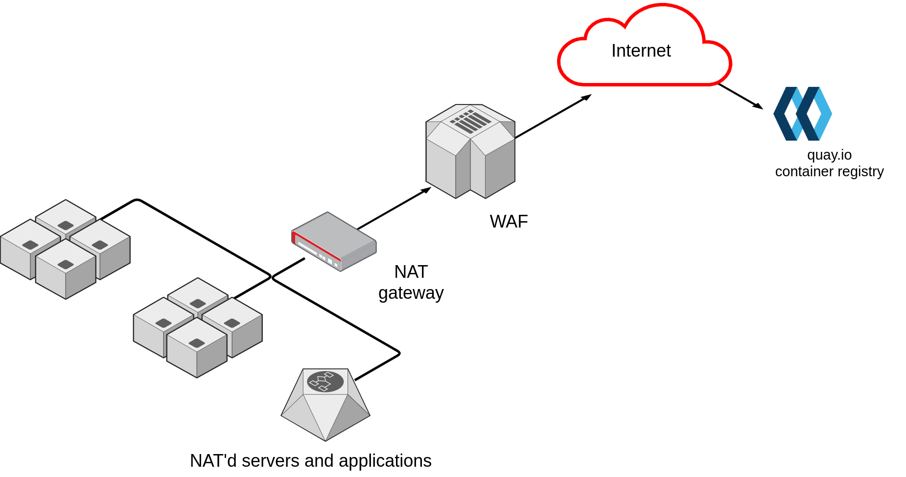

# Welcome to Taxonomy of Deployment Patterns

## Why does this document exist
NAT, Proxy, Air-Gapped, Disconnected...these terms appear frequently and occasionally have been used interchangeably. Each one of these describes a networking configuration that has a significant impact on how software applications can be deployed, as well as the assumptions that can be made around how the Internet can be accessed (if at all), and how data transfers occur in the environment.

When talking with customers and other organisations, having a common language around application deployments is crucial.

This document serves to set the record straight - or at least firmly crooked (with apologies to Douglas Adams) - on what each of these models involves. Each connectivity model includes a description along with a diagram to illustrate the concept.

## Types of connectivity
This is a simple repository to explain what terms like “Air-Gapped”, “Proxy” and “Disconnected” mean in the real world. 

* Directly Connected
* NAT
* Cloud Gateway
* Proxy
* Disconnected
* Air-Gapped

### Directly Connected
Directly connected systems refer to those that are provided with an Internet-routable IP address. These will be rare, and are probably isolated to network edge gateways through which traffic will ingress and egress the corporate network.

Traffic exiting this host will not be passed through Network Address Translation (NAT), or a proxy. The next hop will be the gateway router of the Internet Service Provider of the organisation.

### NAT
Systems behind a Network Address Translation (NAT) gateway share a public IP. These systems are commonly referred to as being “natted”, and this is usually how you will access the internet as an internet service provider (ISP) customer. NAT doesn’t really provide any security benefits for your architecture - it simply obscures your hosts behind a single public IP address.

By design NAT breaks the “end-to-end” principle of IP communications by rerouting and transforming packets, and this can cause issues with applications. A well-known example is the File Transfer Protocol (FTP) - in conventional (active) FTP, the client opens a control connection to the server, and then commands the server to connect back to its own IP address to open a data transfer connection. When behind a NAT, the client will provide its private address, which is not reachable behind the NAT gateway. 

### Cloud Gateway
Cloud gateways connect your on-premises hosts and systems to public cloud services. Some examples of these services include Microsoft Azure ExpressRoute, AWS Direct Connect, and Google Cloud Dedicated Interconnect. Typically these services use BGP to route data from your datacenter to public cloud datacenters over WAN links.  

### Proxy
A proxy server acts as a gateway between an organisation's internal clients (users and systems) and the internet. 

A proxy inspects traditional website traffic such as access to nytimes.com, along with access content repositories like pypi.org and nuget.org. Proxy servers provide varying levels of inspection and can be configured to inspect HTTP, as well as HTTPS traffic. A common pattern is for proxy servers to require users or endpoints to authenticate before being granted access to the internet.

If you are developing software to operate within an Enterprise or Government organisation its important to support authenticated proxy access. Even if your software is intended to run on a public cloud provider, Enterprises still enforce that all traffic must transit a proxy before being accessing the public internet or even a public API endpoint of a cloud provider. 

### Disconnected
A Disconnected network is different from an Air-Gapped network. We make this distinction because of the confusion between the two. 

Simply, a disconnected network may have intermittent or non-permanent access to internet resources. A common deployment pattern is for clients and servers to be disconnected from the internet, but obtain all their artifacts / content via mirroring systems like Artifactory, Quay or Nexus. 

For example: two systems straddling both sides of a firewall. On one side a content repository (repo-a) that mirrors directly from the internet, and on the other side a repository (repo-b) that mirrors directly from repo-o.  

Disconnected systems are slowly becoming synonymous with Edge commuting. An edge server may receive signals from many hundred Internet of Things (IoT) devices. The edge server could be considered disconnected from the central edge management hub as its connectivity may be intermittent or highly regulated and inspected. 

### Air-Gapped
Air-gapped networks extend the concept of the ‘disconnected’ network by physically isolating the network. These networks have an entirely separate routing and switching infrastructure that provides no connectivity to any systems outside the air-gapped network. Visualise air-gapped networks as islands in the ocean, with no bridges to connect to them, and no communication with the outside world.

These networks are used for workloads or data that require the highest level of protection. For example, these are extremely common in national security organisations that must isolate data based on classification. They are also common in heavily regulated industries, such as Financial Services. These networks can also be used to keep something *in*, i.e. for researchers analysing particularly virulent malware.

Data transfers for these networks are nearly always manual. Transferring data into the air-gapped environment will involve an operator copying content onto removable media, walking the removable media across the room (hence the origin of the term ‘sneakernet’), scanning the data for malware, connecting the media to the air-gapped system and transferring the data. On extremely rare occasions these networks may come with a ‘data diode’ for one way data transfer, but these should not be expected to exist.

### Contributors
* Adam Goossens
* Shane Boulden
* Rarm Nagalingam

### Support or Contact

We welcome contributions and updates. Please lodge a pull request. 
